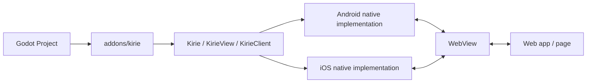

# godot-kirie

Kirie is an experimental Godot plugin project for embedding platform WebViews and
building IPC between Godot and web content.

## Installation

Download `kirie-addon.zip` from a GitHub Release asset and extract it into the
root of your Godot project. The final layout should be:

```text
res://addons/kirie/
```

If your project already has an `addons` directory, merge the extracted `addons`
directory into the project root. Do not extract the zip inside the existing
`addons` directory.

After copying the files, enable Kirie from Godot's Project Settings Plugins tab.
This follows Godot's plugin installation flow. Release packaging details live in
[docs/addon-release.md](docs/addon-release.md).

## Export Options

Kirie adds Godot export preset options under `kirie/debug`:

- `enable_web_inspector`: enable platform WebView inspection for exported apps.
- `allow_tls_bypass`: allow invalid TLS certificates for exported apps. On iOS,
  enabling this also relaxes App Transport Security (ATS) by allowing arbitrary
  loads, which can permit insecure cleartext HTTP requests in addition to bypassing
  invalid TLS certificates.

Both options default to disabled and are intended for development exports only.
In particular, `allow_tls_bypass` reduces transport security and must not be
enabled for production builds.

## Current Architecture



The repository is still deliberately small, but it now has distinct package,
example, and regression-test areas:

- `packages/kirie`: the Godot addon, C# wrapper, and Android and iOS native
  plugin code
- `packages/ipc`: a thin browser-side transport wrapper for Kirie WebView pages
- `packages/ipc-eventa`: browser-side Eventa adapter over Kirie text IPC
- `packages/GdKirie.EventaAdapter`: .NET 10 Eventa adapter over Kirie text IPC
- `examples/basic-ipc`: the first runnable manual integration example
- `examples/eventa-csharp`: manual Godot C# Eventa adapter smoke example
- `tests/integration`: exported-app platform integration tests
- `gulpfile.ts`: native artifact and integration export orchestration
- `scripts`: local run helpers for native validation
- `docs`: project notes and design decisions
  - `docs/dreams`: exploratory notes for ideas outside the current milestone

Primary references live in [docs/references.md](docs/references.md).

The first milestone is limited to:

1. Create a WebView on mobile and desktop platforms.
2. Establish bidirectional IPC between Godot and the WebView.
3. Support packaged `res://` web content loading for bridge tests.
4. Add desktop Godot CEF compatibility, starting with macOS.
5. Stabilize the minimum Kirie plugin shape before adding adapters and tooling.

At this stage, Kirie is intended to stay a low-level WebView and IPC bridge. A
small `@gd-kirie/ipc` browser package exists as a convenience transport wrapper.
Eventa adapters live above that bridge: `@gd-kirie/ipc-eventa` for browser
pages, and `GdKirie.EventaAdapter` for .NET 10 C# projects. The C# surface is a
thin `KirieClient` wrapper over the same platform singleton used by GDScript,
with C# events for the current Kirie signals.

The Android IPC experiment uses explicit text, binary, and data lanes over CBOR
packets. The browser package encodes and decodes those packets with
`cborg`, while Android native code uses Jackson CBOR and converts structured
data through Jackson's tree model before emitting Godot-compatible values. JSON
and Eventa envelopes remain caller or adapter choices carried over the text
lane, not Kirie core payload types. iOS is still on the previous text-oriented
native path and has not yet been migrated to binary CBOR lanes.

Desktop compatibility starts with Godot CEF as Kirie's desktop WebView backend,
with macOS as the first target. Scope and runtime-injection details live in
[docs/architecture.md](docs/architecture.md).

`GdKirie.EventaAdapter` intentionally targets `net10.0` because the upstream
Eventa .NET package targets `net10.0`, and .NET 8 LTS reaches end of support on
2026-11-10. Godot C# projects targeting `net8.0` or `net9.0` should expect
restore or build failures when referencing the adapter.
