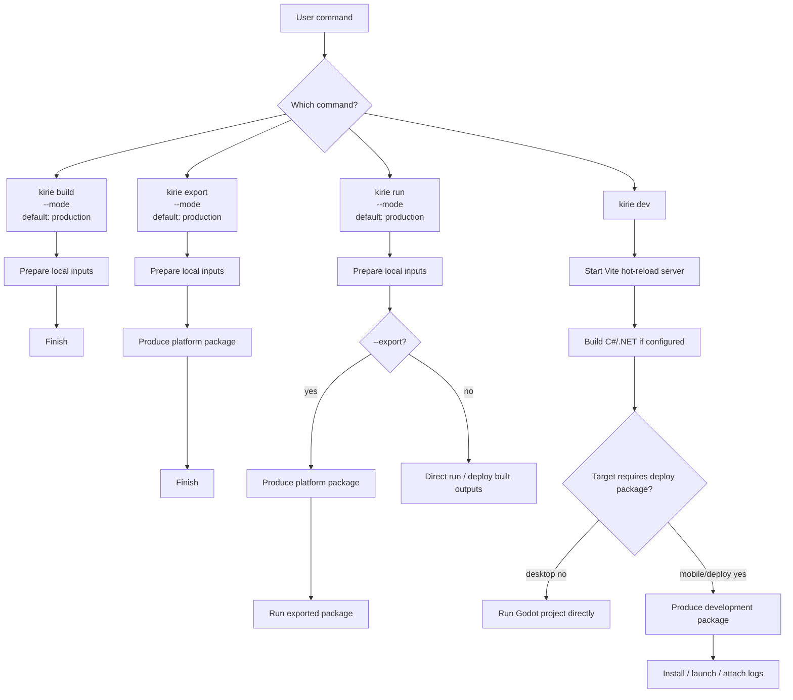

# Architecture Notes

Kirie is evolving into an application framework with an embeddable low-level
Godot plugin and IPC core. The repository scope is still intentionally
constrained, but the constraint now applies to where higher-level behavior
belongs, not to limiting the whole project to a minimum plugin shape.

The low-level plugin and IPC core provide:

- a Godot-facing Kirie service
- a scene-friendly KirieNode node
- a thin C# KirieClient wrapper for .NET projects
- Android and iOS native WebView implementations
- a desktop Godot CEF backend, starting with macOS
- packaged `res://` web resource loading for exported apps
- a repo-level platform integration test project

Application-framework behavior such as CLI workflows, BrowserWindow-style
composition, routing, export orchestration, and mobile development sessions
belongs above that core. The current `@gd-kirie/ipc` package is intentionally
only a browser-side transport wrapper on top of the raw native bridge. Eventa
adapters live above Kirie and use that low-level text transport.

The mobile IPC experiment keeps Kirie core byte-oriented and CBOR-based while
preserving separate text, binary, and data lanes. Higher-level protocols,
including Eventa adapters, remain above Kirie. Android carries CBOR packets
through AndroidX WebKit ArrayBuffer message channels. iOS carries CBOR packets
as base64 strings through WKWebView script messages and keeps native
serialization coverage for the same lane payload contract.

## Current Godot API direction

`kirie` is the low-level WebView and IPC bridge.

Higher-level semantics such as event routing, richer message contracts, or
request/response abstractions are expected to live above this layer, for example
in future app-specific adapters above Kirie or `@gd-kirie/ipc`.

Current public Godot-facing names should stay close to that low-level role:

- `create_webview(options := {})`
- `destroy_webview()`
- `load_url(url)`
- `load_html_string(html, base_url := "")`
- `send_text(message)`
- `send_binary(bytes)`
- `send_data(value)`
- `get_launch_option(key)`

These names describe the current low-level transport API. Android implements
the lane shape with AndroidX WebKit ArrayBuffer message channels and CBOR
packets. iOS implements the same text, binary, and data lanes with CBOR packets
carried as base64 strings through WKWebView script messages.

The Godot-facing `Kirie` script is expected to stay a thin wrapper over the
platform singleton, keeping naming and serialization concerns on the Godot side
without duplicating native lifecycle logic.

The C# `KirieClient` wrapper follows the same low-level surface and forwards to
the same platform singleton. Its public API should feel idiomatic to .NET users:
methods use C# naming, and Kirie signals are exposed as C# events. Internal
Godot `Callable` usage exists only to connect native singleton signals.

Current signals should also stay narrow:

- `webview_ready`
- `text_received`
- `binary_received`
- `data_received`
- `ipc_error`

Browser lifecycle events and higher-level invocation APIs are intentionally
deferred until there is a real need for them.

For the current milestone, Kirie should treat `KirieNode` as the public
scene-tree ownership unit for a platform WebView. A user may place a
`KirieNode` under the main scene, under a Godot `Window` node, or in another
scene structure that fits their project.

Kirie core should not own window organization. Optional higher-level helpers may
later provide prefab window, panel, workspace, cross-view forwarding, or routing
APIs, but those helpers must live above the low-level WebView and IPC surface.
Do not add Electron-like BrowserWindow APIs to GDScript; future high-level
window APIs should live in C# and TypeScript packages, with GDScript remaining
the low-level plugin substrate.

The public Godot API should primarily let users address WebViews through node
references:

- `$KirieNode.load_url(url)`
- `$KirieNode.send_text(message)`
- `$KirieNode.send_binary(bytes)`
- `$KirieNode.send_data(value)`

Native implementations may keep internal handles or IDs to manage platform instances.
Android and iOS use private view IDs only to route callbacks back to the owning `KirieNode`; public routing names, browser-driven cross-view forwarding, and window helper APIs are deferred higher-level concerns.

Kirie supports loading packaged offline web content from Godot project
resources. The current native resolvers can serve packaged `res://` paths. The
planned Kirie CLI app layout standardizes production web content at
`res://src-web/dist/index.html`, as described below.

## Runtime debug configuration

Debug behavior that affects exported applications is controlled by Godot export
preset options, not by automatically detecting whether the export itself is a
debug build.

The current export preset options are:

- `kirie/debug/enable_web_inspector`
- `kirie/debug/allow_tls_bypass`

On Android, the export plugin writes these values as application manifest
metadata for the native plugin to read at runtime. On iOS, it writes matching
Info.plist values. The iOS ATS widening plist block is injected only when
`kirie/debug/allow_tls_bypass` is enabled.

Android native artifact selection is separate from application debug behavior.
Exports use `Kirie-release.aar` by default. Repository-local Android native
debugging can opt into `Kirie-debug.aar` for a single export by passing
`-- --kirie-android-aar=debug` to the Godot export command.

## Kirie app layout and CLI direction

The planned Kirie application shape is a Godot project with a Vite web frontend
beside the Godot source:

```text
kirie.config.ts
package.json
pnpm-lock.yaml / bun.lock / package-lock.json
project.godot
src-godot/
  main.tscn
  main.gd or main.cs
src-web/
  index.html
  src/
  assets/
  dist/
addons/
  kirie/
  godot_cef/
  others/
```

Directory responsibilities are:

- `src-godot`: Godot host application source.
- `src-web`: Vite web UI source and production build output.
- `addons`: Godot plugins. Kirie remains installed as `addons/kirie`, and Godot
  CEF remains installed as `addons/godot_cef`.
- `kirie.config.ts`: Kirie CLI configuration for coordinating Godot, Vite, and
  local build inputs.
- `@gd-kirie/build`: publishable JavaScript API for build and export automation
  that can be used without the Kirie CLI.

Kirie does not own native platform project directories. Do not introduce
Capacitor-style `ios/` or `android/` project trees into Kirie user projects.
Native capabilities should be provided by Godot plugins.

The planned Kirie CLI surface is intentionally small. The current implemented
subset covers desktop development, local build inputs, platform export, and
mobile install-and-launch flows:

```sh
kirie dev
kirie build
kirie build web
kirie build dotnet
kirie export android
kirie export ios
kirie run android
kirie run ios
```

The broader application workflow should keep these command semantics. The
`--mode <mode>` option is planned; the current implementation does not support
it yet:

```sh
kirie build [--mode <mode>]
kirie export [--mode <mode>]
kirie run [--mode <mode>] [--export]
kirie dev
kirie init
kirie doctor
kirie doctor --fix
```



In this model, `build` prepares local inputs, `export` packages those inputs,
`run` runs or deploys the built inputs without exporting by default, and `dev`
runs a hot-reload development session. `run --export` is the explicit form for
exporting before running; users may also run `kirie export && kirie run` when
they want the steps separated. For exported mobile targets, `run` is an
install-and-launch command: Android `run` installs the default APK before
starting the app, and iOS simulator `run` installs the selected `.app` before
launching it. `build`, `export`, and `run` default to `production` mode and
should accept `--mode <mode>` for `development`, `staging`, or other
user-defined modes once that option is implemented. `dev` should never run the
production web build because it owns the Vite hot-reload server; desktop
development can run without exporting, while mobile or deploy-style development
may use a development export path. `dev` may still build the Godot C#/.NET
project when one is configured.

`@gd-kirie/build` owns explicit-input programmatic build and export primitives.
Development sessions, mobile device selection, install, launch, launch-option
injection, log streaming, and watch policy stay in `@gd-kirie/cli`.

`kirie dev` starts a Vite development server, reads the actual resolved URL
after Vite listens, launches Godot as a child process, and injects:

```text
KIRIE_DEV=1
KIRIE_WEB_URL=http://127.0.0.1:<actual-port>/
```

Before launching the development session, `kirie dev` runs Godot in headless
import mode for the project. Use Godot's `--import` command-line option for this
prepare step rather than hand-rolling editor flags; the Godot command-line
reference defines `--import` as starting the editor, waiting for resources to be
imported, and then quitting. This is a CLI fresh-project concern: ordinary Godot
addon usage normally passes through the editor or project manager first, while a
one-command `kirie dev` run may otherwise parse the main scene before Godot has
registered addon `class_name` scripts such as `GdKirie` in the global script
class cache. See `docs/references.md` for the Godot command-line and GDScript
named-class references.

The CLI does not support Finder, Dock, or other non-CLI launched macOS app
processes. It only supports development sessions that the CLI starts and owns.

`kirie build` builds local intermediate artifacts needed by a runnable or
exportable Godot project, but it does not produce platform application packages.
It should build every configured or clearly discovered input. `kirie build web`
builds only the Vite web output, and `kirie build dotnet` builds only the
Godot C#/.NET project when one is configured or discovered. If no C# project is
configured or discovered, the aggregate `kirie build` command may skip the
`.NET` step; if a C# project is present, C# build failure must fail the command.

`kirie export` means a complete platform export workflow: build local inputs
first, then call Godot's export flow for the selected platform or preset.
`kirie run` should build local inputs first, then directly run the scene or
deploy the built outputs by default. For Android exports, deploy means
installing the default `kirie export android` output before launching the Godot
activity. It should only run an export workflow when the user passes
`--export`. Neither command should silently create or repair project
configuration.

`kirie init` and `kirie doctor --fix` are the explicit commands allowed to
write configuration. `kirie init` initializes Kirie-owned files and may register
required Godot project settings. `kirie doctor` is read-only diagnostics.
`kirie doctor --fix` may apply supported repairs. Any writes to Godot-owned
configuration files, including `project.godot` and `export_presets.cfg`, must
go through Godot itself, for example a headless helper script using
`ProjectSettings` or `ConfigFile`. JavaScript code must not patch
Godot configuration text directly.

Kirie enforces Vite as the web toolchain. Users should not hand-write a fixed
development URL. The CLI should let Vite handle port conflicts, then pass the
resolved URL to Godot. Advanced Vite configuration belongs under
`web.vite` in `kirie.config.ts`; Kirie owns the base Vite invariants:

```text
root = web.root
base = "./"
server.host = "127.0.0.1"
server.port = 5173
server.strictPort = false
server.open = false
build.outDir = "dist"
```

User-supplied `web.vite` may extend Vite for plugins, aliases, defines, CSS,
JSON, extra assets, proxying, headers, HMR details, Rollup options, and
dependency optimization. It must not override Kirie-owned invariants such as
`root`, `base`, `server.host`, `server.port`, `server.open`, or
`build.outDir`. Explicit command-line flags may override runtime server values
for a single invocation.

Kirie command-line flags are Kirie API, not an implicit promise to support the
entire Vite CLI surface. The planned `kirie dev` flags are:

```text
--config <path>       Kirie config file path, not a Vite config path.
--project <dir>       Godot project directory, defaulting to the current project.
--godot <path>        Godot executable override.
--host <host>         Vite dev server host override.
--port <number>       Vite dev server port override.
--strict-port         Fail if the requested Vite port is unavailable.
--mode <mode>         Vite mode.
--force               Force Vite dependency pre-bundling.
--log-level <level>   Vite log level: info, warn, error, or silent.
--clear-screen        Allow Vite to clear the terminal.
--no-clear-screen     Prevent Vite from clearing the terminal.
```

Kirie must either parse and map Vite-shaped flags explicitly to Vite's public
JavaScript API or proxy them to the real Vite CLI. Unknown flags must fail
instead of being silently ignored. Arguments after `--` on `kirie dev` are
reserved for Godot:

```sh
kirie dev --host 0.0.0.0 --port 5173 --mode staging -- --verbose
```

`--open` is intentionally not part of `kirie dev` because Kirie launches Godot
instead of opening a browser. `--base`, `--outDir`, and Vite's own `--config`
are also not part of the `kirie dev` surface because Kirie owns those values
through `kirie.config.ts` and the app layout.

The current CLI plan keeps these outside the application workflow:

- `kirie create`
- BrowserWindow APIs

Mobile development targets should use one platform command with unified device
selection, for example `kirie dev ios --device <selector>` and
`kirie dev android --device <selector>`. The user-facing API should not split
iOS simulator and iOS device into separate target names. Kirie may still use
different launch backends internally for simulators, real devices, Android
emulators, and Android devices.

## Packaged web resource loading

`res://` web loading is scoped to resources that are exported with the
application package itself.

For Android, Kirie should resolve `res://` web URLs against files exported into
the APK/AAB assets. For iOS, Kirie should resolve `res://` web URLs against
files exported into the app bundle. Runtime-mounted Godot packs are explicitly
out of scope for this path.

When loading `http://`, `https://`, or `file://` URLs, Kirie should keep using
the platform WebView's default loading behavior instead of intercepting or
rewriting those URLs.

The planned Kirie CLI app layout uses `res://src-web/dist/index.html` as the
default production entry. When that migration is implemented, the addon export
plugin should package `res://src-web/dist` for Android and iOS exports, fail
export when `res://src-web/dist/index.html` is missing, and drop the previous
`res://web` behavior instead of preserving a compatibility layer. Users should
continue to use Godot's official export preset flow by default. Kirie may
diagnose export preset issues, and explicit setup or repair commands may write
supported preset changes through Godot, but normal run, build, and export
commands must not silently mutate export presets.

## Desktop Godot CEF direction

Kirie now treats Godot CEF as the desktop WebView and IPC backend compatibility
target. The first desktop target is macOS. Windows and Linux should follow the
same shape once macOS works, but iOS and Android continue to use their platform
WebView implementations.

This work is scoped to Kirie's current low-level WebView and IPC surface:

- `create_webview`
- `destroy_webview`
- `load_url`
- `load_html_string`
- `send_text`
- `send_binary`
- `send_data`
- `webview_ready`, `text_received`, `binary_received`, `data_received`, and
  `ipc_error`

Do not expose Godot CEF's full browser-control API as Kirie API just because the
desktop backend can do it. If Kirie later adopts more of the Godot CEF IPC
surface, add each capability only when there is a cross-platform plan for the
Android WebView and iOS WKWebView backends.

The `@gd-kirie/ipc` browser package should not detect backend implementation
details such as `window.sendIpcMessage` or Android channel object names. It
should select its transport from the Kirie runtime platform object:

```ts
interface KiriePlatform {
  os: "android" | "ios" | "macos" | "windows" | "linux";
  backend: "webview" | "wkwebview" | "godot-cef";
}

interface KirieRuntime {
  platform: KiriePlatform;
}

interface Window {
  kirie?: KirieRuntime;
}
```

The runtime object belongs to Kirie, not to Godot CEF. Godot CEF currently
documents renderer-side IPC globals such as `window.sendIpcMessage`,
`window.sendIpcBinaryMessage`, and `window.sendIpcData`, but not a stable
platform-information object.

Desktop Godot CEF binaries are external downloaded artifacts, not part of the
default `kirie-addon.zip`. Kirie's pinned Godot CEF version and artifact
checksum live in `addons/kirie/godot_cef.json`. Only desktop run or export flows
should check for Godot CEF. If a required desktop artifact is missing, fail
before export or run and print the exact setup command. Android and iOS workflows
must not require a Godot CEF download.

Downloaded Godot CEF addons should use the standard Godot addon layout:

```text
addons/godot_cef/
```

This lets Godot load the Godot CEF GDExtension normally. Repository instances of
that directory are ignored and should not be committed. Download logic must pin
the Godot CEF version and verify the downloaded artifact before installing it.
The repository installer command is:

```sh
mise run install:godot-cef <godot-project-dir>
```

## JavaScript runtime injection

Kirie browser-side code requires one invariant:

```text
Kirie initializes the JavaScript global before any user page script runs.
```

The injected runtime must be small and must not depend on the DOM. It should only
require `globalThis` or `window`:

```js
globalThis.kirie ??= {};
globalThis.kirie.platform = Object.freeze({
  os: "macos",
  backend: "godot-cef",
});
```

The platform mapping for this pre-page-script injection is:

- Android: `WebViewCompat.addDocumentStartJavaScript`, registered before
  `loadUrl`, `loadData`, or `loadDataWithBaseURL`. Android documents this as a
  document-beginning script that runs before page JavaScript, while the DOM tree
  might not be ready.
- iOS: `WKUserScript` with `WKUserScriptInjectionTime.atDocumentStart`, added to
  the `WKUserContentController` before the `WKWebView` loads content. Apple
  documents this as after creation of the webpage document element but before
  loading other content.
- Godot CEF: set `CefTexture.preload_script` or `preload_script_path` before the
  `CefTexture` node enters the scene tree or before its browser is otherwise
  initialized. Godot CEF documents this as running after its built-in JavaScript
  bridge is registered and before the document loads.

Godot CEF's public Godot-facing API also documents `eval(code)`, but `eval`
executes JavaScript in the browser's main frame after the page exists. Do not use
`eval` for Kirie's runtime initialization because it cannot guarantee that the
runtime is available before the user's module bundle runs.

This mirrors established desktop WebView framework patterns. Electron uses a
preload script that runs before the page is loaded and is commonly used to
expose renderer IPC APIs. Tauri exposes initialization scripts whose documented
timing is after the global object is created but before the HTML document is
parsed and before scripts in the HTML run; it also documents an Android fallback
that prepends initialization scripts to each HTML head when document-start
support is unavailable. Wails serves `index.html` with injected IPC and runtime
scripts. Kirie's HTML rewrite is therefore an intentional first step, not the
final preferred backend hook.

## iOS packaging direction

For the current milestone, iOS should follow the same addon-centered shape as
Android:

- users consume `addons/kirie`
- produced addon trees include `addons/kirie/ios/Kirie.debug.xcframework` and
  `addons/kirie/ios/Kirie.release.xcframework`
- the addon export plugin injects the xcframework, system frameworks, plist
  content, and native initialization glue through Apple export hooks
- example projects should not carry a separate `res://ios/plugins` shim

This is aligned with Godot's iOS plugin model in behavior, while keeping Kirie's
install shape addon-centered:

- Godot's iOS plugin guide defines a native iOS plugin as a static library or
  static-library `.xcframework` with Godot headers, initialization and
  deinitialization entry points, matching Godot compile flags, optional debug
  and release variants, and a `.gdip` descriptor.
- Kirie keeps the same native binary and entry-point model, but does not rely on
  `.gdip` auto-discovery under `res://ios/plugins`. The addon export plugin owns
  discovery and injects the selected framework, plist content, bundle resources,
  and initialization glue through `EditorExportPlugin` Apple embedded platform
  hooks.
- Kirie builds `Kirie.debug.xcframework` from the `ReleaseDebug` configuration
  and `Kirie.release.xcframework` from the `Release` configuration. The
  `ReleaseDebug` naming follows the upstream Godot iOS plugins repository,
  which documents that official debug export templates are compiled with
  `release_debug`, not the full `debug` target.
- Native iOS Godot-facing classes should be registered through ClassDB and bind
  their signals in `_bind_methods` with `ADD_SIGNAL`. This keeps signal metadata
  in Godot's normal object system instead of maintaining a separate callback
  registry in Kirie.

The official iOS plugin documentation still describes `res://ios/plugins`
because that is Godot's automatic plugin discovery path. Kirie's exception is
only the packaging location and activation mechanism; the binary ABI, build
flags, entry points, and exported Xcode integration remain based on Godot's
iOS plugin and Apple embedded platform export APIs.

## GitHub Release addon flow

GitHub Release addon publishing is configured through the `Addon Release`
workflow. Keep it separate from the npm publishing flow, which is only for
browser-side workspace packages such as `@gd-kirie/ipc` and
`@gd-kirie/ipc-eventa`.

The release artifact shape and workflow modes live in
[Addon Release](./addon-release.md).

The .NET Eventa adapter uses a separate NuGet release lane. Keep it separate
from addon zip publishing and npm publishing.

## IPC and adapter split

Kirie IPC is moving from the previous JSON-shaped message path to explicit
`text`, `binary`, and `data` lanes. Android currently implements this lane shape
over byte-oriented CBOR packets:

- text payloads are CBOR text strings
- binary payloads are CBOR byte strings
- data payloads are a constrained cross-platform data subset: null, booleans,
  numbers, strings, arrays, and maps with string keys

Godot objects, nodes, callables, RIDs, symbols, functions, custom classes,
cycles, dates, regular expressions, and other engine-local or JavaScript-local
values are out of scope for the data lane.

### Data lane type mapping

The data lane keeps one semantic subset across the browser, Godot wrappers, and
Android native code, but each layer uses its own host-language representation:

| Data lane value | TypeScript `@gd-kirie/ipc` | Godot GDScript | Godot C# | Android Kotlin after bridge |
| --- | --- | --- | --- | --- |
| null | `null` | `null` / `TYPE_NIL` | `Variant.Type.Nil` | `null` |
| boolean | `boolean` | `bool` / `TYPE_BOOL` | `Variant.Type.Bool` | `Boolean` |
| integer | `number` | `int` / `TYPE_INT` | `Variant.Type.Int` | `Long` |
| float | `number` | `float` / `TYPE_FLOAT` | `Variant.Type.Float` | `Double` |
| string | `string` | `String` / `TYPE_STRING` | `Variant.Type.String` | `String` |
| array | `KirieData[]` | `Array` / `TYPE_ARRAY` | `Variant.Type.Array` | `Array<*>` |
| map/object | `{ [key: string]: KirieData }` | `Dictionary` / `TYPE_DICTIONARY` | `Variant.Type.Dictionary` | `Dictionary` |

The public Godot API stays Variant-shaped: GDScript exposes
`send_data(value: Variant)`, and C# exposes `SendData(Variant value)`. Android
does not expose a single Kotlin `Any?` entrypoint for all data lane values,
because Godot's Android plugin bridge registers JVM parameter types for
conversion. A Kotlin `Any?` parameter becomes `java.lang.Object`; Godot treats
that as a Java object parameter, not as a general Variant parameter. A Kotlin
`Array<Any?>` parameter becomes JVM `Object[]`; Godot treats that as a typed
JavaObject array, not as a heterogeneous Godot `Array`.

The Godot wrappers therefore validate the root `Variant` kind, place the value
under a private `Dictionary` key, and call one Android `sendData(Dictionary)`
method. The Android plugin unwraps that key immediately before CBOR encoding.
The `Dictionary` exists only at the Godot Android bridge boundary; it is not the
data lane protocol shape, and it does not force CBOR values to be map roots.
Root `null`, scalar, array, and map values are still encoded as their original
CBOR data item.

The relevant Godot 4.6.2 stable sources are
[`GodotPlugin.java`](https://github.com/godotengine/godot/blob/001aa128b1cd80dc4e47e823c360bccf45ed6bad/platform/android/java/lib/src/main/java/org/godotengine/godot/plugin/GodotPlugin.java#L153-L161)
method registration,
[`godot_plugin_jni.cpp`](https://github.com/godotengine/godot/blob/001aa128b1cd80dc4e47e823c360bccf45ed6bad/platform/android/plugin/godot_plugin_jni.cpp#L72-L88)
native method registration,
[`java_class_wrapper.cpp`](https://github.com/godotengine/godot/blob/001aa128b1cd80dc4e47e823c360bccf45ed6bad/platform/android/java_class_wrapper.cpp#L118-L128)
Java object argument validation,
[`java_class_wrapper.cpp`](https://github.com/godotengine/godot/blob/001aa128b1cd80dc4e47e823c360bccf45ed6bad/platform/android/java_class_wrapper.cpp#L224-L247)
array argument validation, and
[`jni_utils.cpp`](https://github.com/godotengine/godot/blob/001aa128b1cd80dc4e47e823c360bccf45ed6bad/platform/android/jni_utils.cpp#L199-L211)
Variant container conversion.

The browser-side `@gd-kirie/ipc` package uses `cborg` for CBOR. Android native
code uses Jackson CBOR because it provides a dynamic `JsonNode` tree for the
data lane; Kotlinx Serialization CBOR is schema-first and is not used for the
dynamic data lane. Android converts `JsonNode` values into Godot-compatible JVM
objects before emitting Godot signals. Do not add a GDScript CBOR codec for this
path.

Godot CEF is a learning reference and future compatibility target because it
separates `ipc_message`, `ipc_binary_message`, and `ipc_data_message`, with its
data lane documented as CBOR-backed.

Eventa remains above Kirie. `@gd-kirie/ipc-eventa` and
`GdKirie.EventaAdapter` support event emission and unary request/response RPC
over Kirie text IPC. Their JSON messages are adapter encodings, not Kirie core
payload types. Treat `moeru-ai/eventa` and `moeru-ai/eventa.net` as the upstream
Eventa projects; do not change those projects unless an adapter exposes a real
design issue. The .NET adapter lives under `packages/GdKirie.EventaAdapter`,
uses the root `GdKirie.slnx`, and provides a NuGet source bridge for connecting
to addon-shipped `KirieClient.cs` without putting Eventa files in
`addons/kirie`.

`GdKirie.EventaAdapter` is `net10.0` only. Projects targeting `net8.0` or
`net9.0` are expected to fail restore or build when they reference it. Do not
copy Eventa protocol logic into Kirie to bypass the upstream Eventa .NET target
framework.

The Eventa adapter should gain a binary or structured transport after the text
transport proves the event and unary RPC shape. Prefer an explicit opt-in entry
point, such as a data-lane context, before changing the default transport. The
binary transport should use Kirie's CBOR-backed data or binary lane directly
instead of layering another JSON string over it, and it should document any
payload restrictions that come from Kirie's cross-platform data subset.
